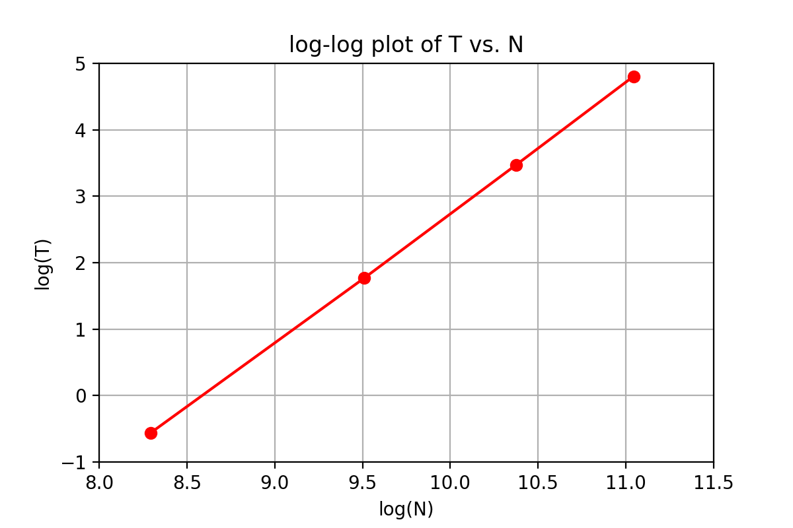

# Assignment01

__From Siqi Liang (liangsiq@usc.edu)__

### Part I

#### I-1. Measuring Computational Complexity 



Code for plotting:

```python
from matplotlib import pyplot as plt
import numpy as np
# load data from MDout.txt
data_path = './MDtime.txt'
data = np.loadtxt(data_path)
N_data = data[:,0]
logN = np.log(N_data)
T_data = data[:,1]
logT = np.log(T_data)

# plot and save the figure
plt.plot(logN, logT,'ro-')
plt.xlabel('log(N)')
plt.ylabel('log(T)')
plt.title('log-log plot of T vs. N')
plt.xlim((8,11.5))
plt.ylim((-1,5))
plt.grid(True)
plt.savefig('./logN_logT_plot.png',dpi=300)
```


To perform linear fit of $log(T)$ vs. $log(N)$, i.e., $log(T) = \alpha log(N) + \beta$.

It is easy to know that 
$$
\theta = (X^T X)^{-1} X^T \vec{y},
$$
where $\vec{y} = [log(T_1), \cdots, log(T_k)]^T$, $\theta = [\alpha ,\, \beta ]^T$,
$$
X = \begin{bmatrix}  
    log(N_1)   & 1 \\
    log(N_2)   & 1 \\
    \vdots &  \vdots \\
    log(N_k) & 1
     \end{bmatrix}.
$$
Use Python to perform this algorithm:

```python
X = np.hstack((logN.reshape(len(logN), 1), np.ones(shape=(len(logN),1))))
y = logT.reshape(len(logT), 1)
pinv = np.linalg.pinv(np.matmul(X.T, X))
theta = np.matmul(np.matmul(pinv, X.T), y)
print('alpha = %.4f, beta = %.4f' % (theta[0], theta[1]))
print('That is\n logT = %.4f * logN %.4f' % (theta[0], theta[1]))
```

The result is $\alpha = 1.9506$

#### I-2. Theoretical Flop/s Performance

For each clock cycle, each core performs $4 \times 2 \times 2 = 16 flop$, so

the theoretical peak performance of your computer  is $4 \times 3 \times 10^9 \times 16flop = 192 \times 10^9 flop/s = 192 Gflop/s$.


### Part II

